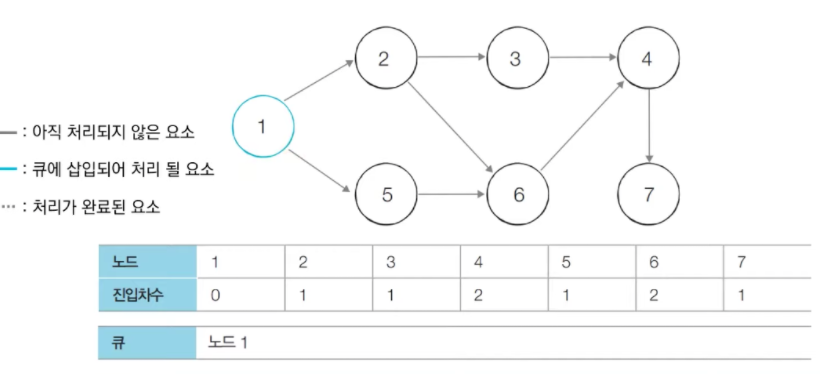

# Topological Sort

**`위상 정렬`**

정렬 알고리즘의 일종으로, 순서가 정해져 있는 일련의 작업을 차례대로 수행해야 할 때 사용할 수 있는 알고리즘

조금 더 이론적인 설명은, 사이클이 없는 방향 그래프의 모든 노드를 '방향성에 거스르지 않도록 순서대로 나열하는 것'을 의미

`진입차수와 진출차수`

위상 정렬 알고리즘을 살펴보기 위해서는 먼저 진입차수와 진출차수에 대한 개념을 알아야한다. 쉬운 개념이기에 아래 그림만으로도 충분히 이해할 수 있다고 생각한다.

진입차수 (Indegree) : 특정한 노드로 들어오는 간선의 개수

진출차수 (Outdegree) : 특정한 노드에서 나가는 간선의 개수

위상 정렬 알고리즘 동작 과정

위상 정렬 알고리즘은 큐를 이용하여 구현한다. 위상 정렬 알고리즘은 다음과 같다.

진입차수가 0인 노드를 큐에 넣는다.

큐가 빌 때까지 다음의 과정을 반복한다.

① 큐에서 원소를 꺼내 해당 노드에서 나가는 간선을 그래프에서 제거

② 새롭게 진입차수가 0이 된 노드를 큐에 삽입

즉, 각 노드가 큐에 들어온 순서가 위상 정렬을 수행한 결과이다!

아래 그림을 통해 동작과정을 이해해보자.

위 그림은 위상 정렬을 수행할 그래프이다. 이때 위상 정렬을 수행할 수 있는 그래프는 사이클이 없는 방향 그래프 (DAG) 이여야 한다!

[step 0] 진입차수가 0인 모든 노드를 큐에 삽입. 현재 1번 노드의 진입차수만 0이므로 큐에 1번 노드만 삽입하게 된다.

https://velog.io/@kimdukbae/%EC%9C%84%EC%83%81-%EC%A0%95%EB%A0%AC-Topological-Sorting