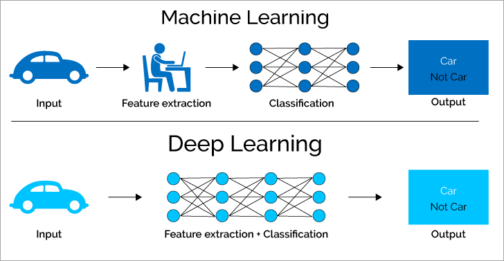

# ML & DL

머신러닝과 딥러닝

머신러닝이건 딥러닝이건 기본적으로 입력이 있고, 활성화 함수를 지나 출력이 되는 구조.

---
둘의 차이는 아래와 같다.

머신 러닝은 인간 작업자가 특정 Feature 에 대한 `가중치 설정`등의 작업이 있어야 하지만, <u>딥러닝은 자기가 찾아서 함</u>. 

레이어의 수 차이가 아님. 

---
[딥러닝 학습 파이프라인](./DN_Training_Pipeline.md)
---

