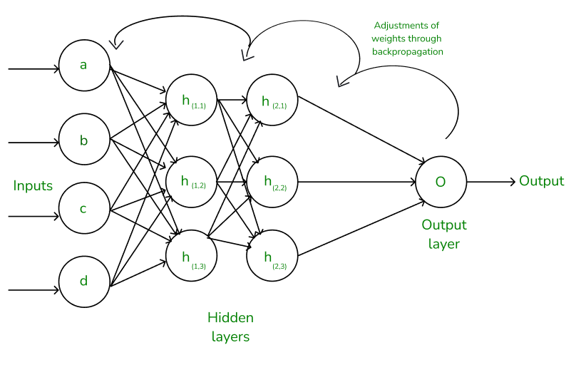

# Deep learning training pipeline

딥러닝의 순서

Input -> Model -> Prediciton -> Loss function -> Gradient descent -> Backpropagation

Model 내부에는 활성함수가 들어가있고, 그 결과값을 가지고

손실함수를 계산한다. 

---

1. Input Layer
   예: 이미지, 텍스트, 센서값 등
    ↓
2. [Hidden Layers (Fully Connected or CNN)](./Hidden_layer.md)
   다양한 비선형 변환을 통해 특징 추출
   ReLU 같은 활성화 함수 사용
   Input layer 와 Output layer 사이의 모든 층.
   [`nn.Linear, nn.Conv2d`](./nnFunction.md), torch.reshape 등 차원축소하는 여러 함수들이 특징 추출 레이어로 사용됨.  
   ↓
3. [Output Layer]()
   ↓
4. [Loss Function (손실함수)](./Loss_function.md)
   ↓
5. [Optimizer]()