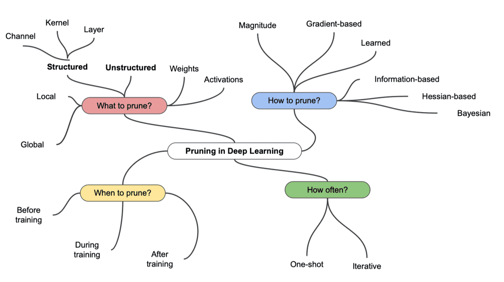

# Pruning

중요도가 낮은 파라미터를 제거하여 네트워크를 가지치기 하는 것

**장점**

추론 속도가 빨라진다(파라미터가 줄어드므로)

Regularization(모델 복잡도를 줄인다)이 일반화 성능을 높인다.

**단점**

정보의 손실이 생긴다

입자도(granularity, 세밀함)가 하드웨어 가속 디자인의 효율성에 영향을 미친다.

너무 sparse하게 만들어버리면 하드웨어 가속 효율이 떨어진다.

언뜻 보면 Overfitting 방지 방법인 Dropout과 유사하지만 다르다.

Pruning은 버리는 정보 재활용 X

Pruning은 한번 잘라낸 뉴런을 보관하지 않는다. 

그러나 Dropout은 regularization이 목적이므로 학습 시에 뉴런들을 랜덤으로 껐다가 (보관해두고) 다시 켜는 과정을 반복한다. 

추론 시에는 모든 뉴런을 켜고 수행한다.

### Pruning 기법들 

