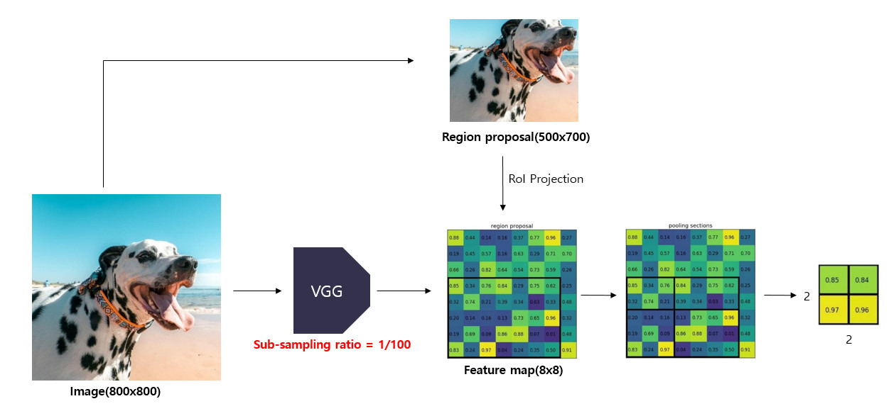

# Fast R-CNN

Fast R-CNN에 대해 학습하기 전에, R-CNN에서 사용된 Region Proposal 의 기본인
`Selective Search' 에 해대 알아보자.
[R-CNN](2.R-CNN.md)

### 어떻게 R-CNN보다 빨라진걸까?

R-CNN은 Proposal 각각에 대해 CNN을 돌리는 형태이므로, 느릴 수 밖에 없음.

여기서 ROI Pooling 을 통해서, Proposal 생성이후 CNN을 여러번 돌리지 않고도 고정 크기 Feature를 얻을 수 있게 하는 것이 핵심 기술 
즉, Proposal 이후 단계 최적화

1장의 이미지를 입력받아서, ROI pooling 하고, 고정된 크기의 feature vector를 fully connected layer에 전달한다. 또한, multi-task loss를 이용해서 모델을 개별적으로 학습시키지 않고, 한 번에 학습시킨다. -> Training & Detection time 감소

메인 아이디어는 아래와 같다. 

### 1. ROI Pooling

ROI Pooling은 ROI를 지정한 크기의 grid 로 나눈 후 max pooling을 수행하는 방법이다.

각 채널별로 독립적으로 수행하고, 이같은 방법을 통해 고정된 크기의 feature map을 출력하는 것이 가능하다.

1) 먼저 원본 이미지를 CNN 모델에 통과시켜서 feature map을 얻는다.
    - 800x800 크기의 이미지를 VGG 모델에 입력해서 8x8 feature map을 얻는다.
    - 이 때, sub-sampling ratio 는 1/100 이다.

2) 동시에 원본 이미지에 대하여 Selective search 적용하여 region proposal 얻는다. 
    - 500x700 proposal 얻음 

3) feature map에서 각 region proposal에 해당하는 영역을 추출한다. 이 과정은 `ROI Projection`을 통해 가능.
Selective search 를 통해 얻은 region proposals는 sub-sampling 과정을 거치지 않은 반면, 원본 이미지의 feature map은 subsampling 을 여러 번 거쳐 크기가 작아져있다. 

작아진 featuremap에서 region proposals이 encode(표현)하고 있는 부분을 찾기 위해 작아진 feature map에 맞게 region proposals를 투영해주는 과정이 필요하다.

이는 region proposal의 크기와 중심 좌표를 sub-sampling ratio에 맞게 변경시켜줌으로 가능하다.

- Region proposals의 중심점 좌표, width, height와 sub-sampling ratio를 활용하여 feature map으로 투영시켜준다.
- feature map에서 region proposal에 해당하는 5x7 영역을 추출한다.

4) 추출한 ROI feature map을 지정한 sub-window의 크기에 맞게 grid로 나눠준다. 
    - 추출한 5x7 크기의 영역을 지정한 2x2 크기에 맞게 grid를 나눠준다.

5) grid의 각 셀에 대하여 max pooling을 수행하여 고정된 크기의 feature map을 얻는다. 

--> 이를 통해 미리 지정한 크기의 sub-window에서 max pooling을 수행하다 보니 region proposal의 크기가 서로 달라도 고정된 크기의 feature map 을 얻을 수 있는 것이다.

### 2. Multi-task loss

Fast R-CNN 에서는 feature vector를 multi-task loss를 사용해 Classifier와 Bounding box regressior 를 동시에 학습시킨다. 

두 모델을 한 번에 학습시키기 때문에, R-CNN모델과 같이 각 모델을 독립적으로 학습시켜야 하는 번거로움이 없다는 장점이 있음.

λ : 두 loss 사이의 가중치를 조정하는 balancing hyperparamter

- K개의 class를 분류한다고할 때, 배경을 포함한 (K+1)개의 class에 대하여 Classifier를 학습시켜줘야 한다.

- u는 positive sample인 경우 1, negative sample인 경우 0으로 설정되는 index parameter이다.

- L1 loss는 R-CNN, SPPnets에서 사용한 L2 loss에 비행 outlier에 덜 민감하다는 장점이 있다.

- λ=1 로 사용한다.

- multi task loss는 0.8~1.1% mAP를 상승시키는 효과가 있다고 한다.

### 3. Hierarchical Sampling

R-CNN 모델은 학습 시 region proposal 이 서로 다른 이미지에서 추출되고, 이로 인해 학습 시 연산을 공유할 수 없다는 단점이 있음.
그래서 <u>feature sharing</u>을 가능하게 하기 위한 수단.

SGD mini-batch를 구성할 때 N개의 이미지를 sampling 하고, 총 R개의 Region proposal을 사용한다고 할 때, 각 이미지로부터 R/N개의 region proposals를 sampling하는 방법.

이를 통해서 같은 이미지에서 추출된 region proposals끼리는 forward, backward propagation 시 <u>연산과 메모리를 공유 가능</u>.

### 4. Truncated SVD

Fast R-CNN 모델은 Detection시 ROI를 처리할 때 FC layer에서 많은 시간이 소요된다. 

이 Detection시간을 감소시키기 위해 사용되는 기법.

추가 작성 필요....