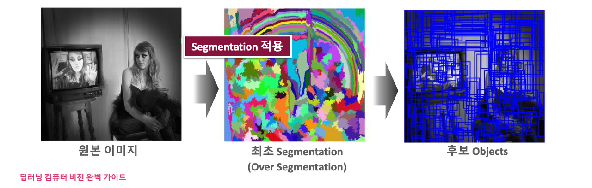
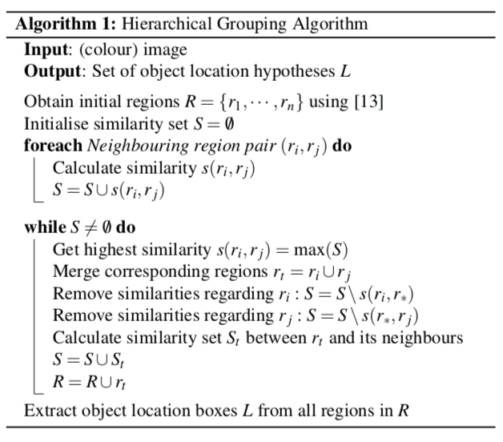
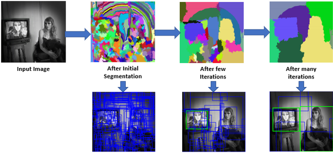

# R-CNN

### Selective search

Selective search 이전에는 물체가 있을만한 영역을 모두 조사해보는 Exhaustive search 방법이 있었다.

쉽게 말해서, Sliding window + multi-scale search 방식이고, 가능한 모든 위치와 크기의 사각형 윈도우를 만들어서 일일히 분류기 (SVM, CNN 등)에 넣는 방식이다.

이런 방식의 문제점을 해결하기 위해 나온 것이 Selective search이고, 

가능한 모든 영역 대신 segmentation 기반 Region proposal 을 뽑아낸 뒤에, 
Feature 기준으로 작은 영역을 합쳐서 의미 있는 후보만을 남기고, 
이 후보들을 분류기에 넣는 방식이다.

아래는 Selective search 과정을 보여준다.

1. 원본 이미지로부터 각각의 Object 들이 1개의 개별 영역에 담길 수 있도록 수 많은 영역들을 생성
(Object 놓치지 않기 위해 Oversegmentation 수행)

2. 알고리즘에 따라 유사도가 높은 것들을 하나의 Segmentataion 영역으로 합쳐준다.

R = r1, ... rn - 최초 segmentation을 통해서 나온 초기 n개의 후보 영역들 

S - 영역들 사이의 유사도 집합

- 색상, 무늬, 크기, 형태를 고려하여 각 영역들 사이의 유사도를 계산
- 유사도가 가장 높은 ri와 rj 영역을 합쳐 새로운 rt 영역을 생성
- ri와 rj 영역과 관련된 유사도는 S 집합에서 삭제
- 새로운 rt 영역과 나머지 영역의 유사도를 계산하여 rt의 유사도 집합 St 생성
- 새로운 영역의 유사도 집합 St와 영역 rt를 기존의 S,R 집합에 추가

3. 2번 과정을 반복하여 최종 후보영역 도출 

이렇게 나온 최종 후보 영역들에 대해서 CNN을 통한 Classification & Bounding box regression 수행하면 Object detection이 수행되는 것임. 

이 과정이 R-CNN 이라고 보면된다.

참조 https://developer-lionhong.tistory.com/31#google_vignette